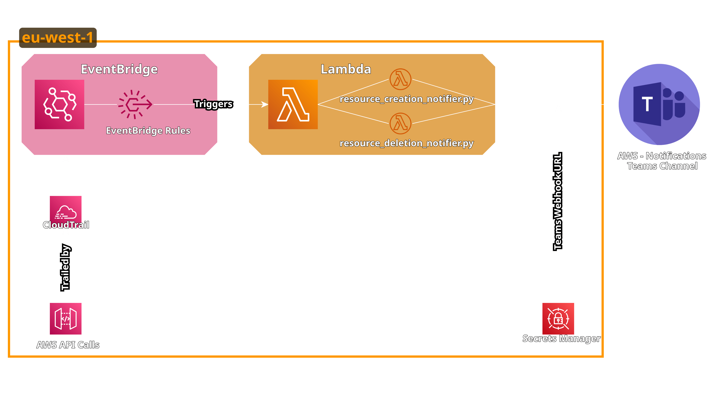
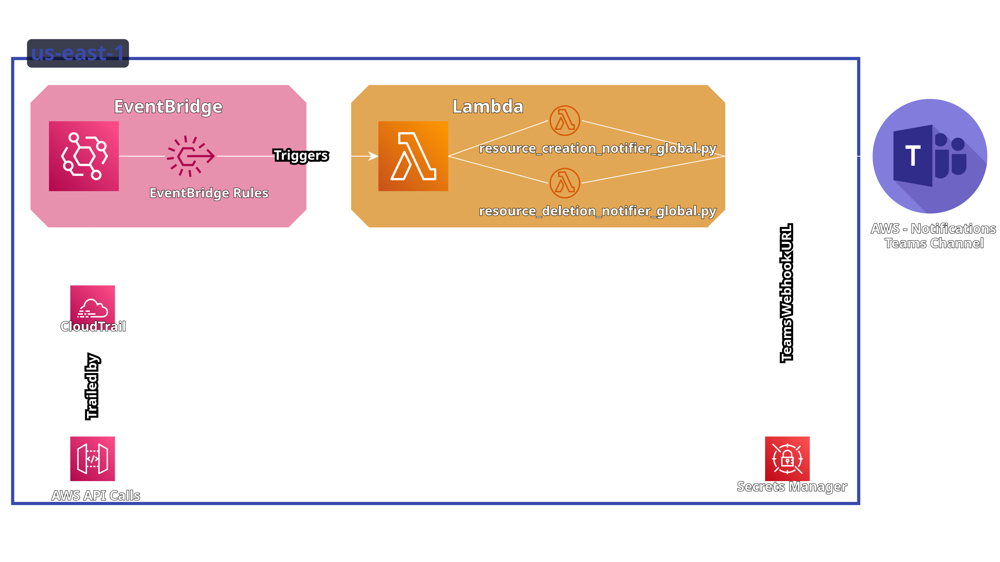

# AWS Resource Notifier

A serverless solution that monitors AWS resources for creation and deletion events and sends notifications to Microsoft Teams.

## Overview

AWS Resource Notifier monitors CloudTrail events to detect when specific AWS resources are created or deleted. When these events are detected, it sends a notification to a Microsoft Teams channel with details about:

- Resource type and name
- Who created/deleted the resource
- When the resource was created/deleted
- Additional resource-specific details such as tags, configuration, and more

## Supported Resources

The following AWS resources are monitored:

### Regional Resources
- EC2 Instances
- S3 Buckets
- RDS Instances
- Lambda Functions
- Security Groups
- VPCs
- Elastic Load Balancers (ALB/NLB)

### Global Resources
- IAM Users
- Route53 DNS Records

## Architecture

The solution uses the following AWS services:
- **AWS CloudTrail**: Records API calls in your AWS account
- **Amazon EventBridge**: Filters CloudTrail events for resource creation and deletion
- **AWS Lambda**: Processes events and sends notifications
- **AWS Secrets Manager**: Securely stores the Microsoft Teams webhook URL

The architecture is split into two components:

1. **Regional Resources Monitoring**: Deployed in each AWS region to monitor region-specific resources

2. **Global Resources Monitoring**: Deployed in a single region to monitor global AWS resources



## Deployment

### Prerequisites

- AWS CLI configured with appropriate permissions
- Python 3.8 or later
- Microsoft Teams webhook URL (see [Teams Webhook Setup](./docs/teams_webhook_setup.md))

### Deployment Steps

Use the provided deployment script to deploy the CloudFormation stacks:

```bash
# Make the script executable
chmod +x deploy.sh

# Deploy with default options
./deploy.sh

# Deploy with custom options
./deploy.sh --region us-west-2 --webhook-url "https://your-teams-webhook-url"
```

The script will deploy:
1. The global resources stack (monitoring IAM and Route53)
2. The regional resources stack in the specified region

### Deployment Options

The deployment script supports several options:
```
Options:
  -h, --help                 Show this help message
  -r, --region REGION        AWS region to deploy to [default: us-east-1]
  -e, --environment ENV      Environment (dev, test, prod) [default: dev]
  -p, --prefix PREFIX        Resource prefix [default: aws-resource-notifier]
  -c, --create-cloudtrail    Create a new CloudTrail (if not provided, uses existing)
  -w, --webhook-url URL      Microsoft Teams webhook URL
  -d, --delete               Delete the CloudFormation stack
```

### Deleting the Stack

To delete the deployed resources:

```bash
./deploy.sh --delete
```

## Multi-Region Monitoring

By default, the regional component monitors AWS resources in a single region (the region where you deploy the stack). If you want to monitor multiple regions, you would need to deploy the regional stack to each region separately.

The global resources (IAM Users and Route53 DNS Records) are monitored from a single region deployment since these resources are global in AWS.

## Notification Features

The solution provides rich, detailed notifications with the following features:

- Modern card-based UI in Microsoft Teams
- Visual indicators showing resource type with AWS service icons
- Resource identification details (name, ID, region)
- Creation/deletion timestamps
- User information (who performed the action)
- Additional metadata about the resource (varies by resource type)
- Direct links to the AWS Management Console

## Configuration

The solution can be configured by modifying:

- **Event Patterns**: Customize which events trigger notifications in the EventBridge rules
- **Lambda Functions**: Modify the notification format or add additional resource types
- **Teams Webhook**: Update the Microsoft Teams webhook URL in Secrets Manager

## Customization

To add support for additional AWS resources:
1. Add new EventBridge rules in the CloudFormation templates
2. Update the Lambda functions to handle the new resource types
3. Add icon mappings for the new services

To customize the notification format:
1. Modify the `create_teams_message` function in the Lambda code
2. Update the HTML/CSS styling for the Teams messages

## Contributing

Contributions are welcome! Please feel free to submit a Pull Request.

## License

This project is licensed under the MIT License - see the LICENSE file for details.
